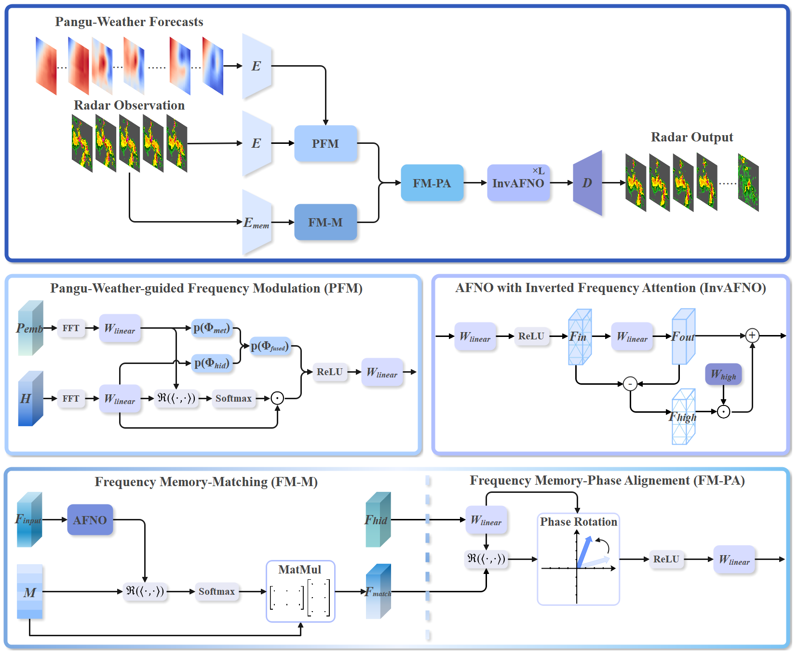

# Extending Precipitation Nowcasting Horizons via Spectral Fusion of Radar Observations and Foundation Model Priors

[](https://www.python.org/downloads/)
[](https://pytorch.org/)

This repository contains the official implementation of **PW-FouCast**, a novel frequency-domain fusion framework designed to extend precipitation nowcasting horizons by integrating weather foundation model priors with radar observations.

---

## 🌟 Key Features

[//]: # (> Our model leverages spectral fusion to bridge the gap between large-scale atmospheric dynamics and local-scale convective patterns.)
> **PW-FouCast:** Pangu-Weather-guided Fourier-domain foreCast.
> Our model leverages Pangu-Weather forecasts as spectral priors within a Fourier-based backbone to effectively resolve the representational heterogeneities between radar imagery and meteorological data.
> 
> 

* **Pangu-Weather-guided Frequency Modulation (PFM):** Steers the model's spectral magnitudes and phases toward physical grounds by aligning them with meteorological priors.

* **Frequency Memory (FM):** Utilizes a learned repository of ground-truth spectral patterns to dynamically correct phase discrepancies and preserve diverse temporal evolution patterns such as expansion and contraction.

* **Inverted Frequency Attention (IFA):** Employs a residual-reinjection mechanism to recover high-frequency components often attenuated by standard spectral filtering, maintaining sharp structural fidelity in long-term forecasts.

* **Extended Nowcasting Horizon:** Significantly outperforms both radar-only and standard multi-modal baselines on SEVIR and MeteoNet benchmarks, mitigating the performance degradation typical of long-lead predictions.

### 🏗️ Model Architecture
[//]: # (![Model Architecture]&#40;docs/assets/model_architecture.png&#41;)
<p align="center">
  
</p>

[//]: # (*Figure 1: Overview of the PW-FouCast framework.*)
<p align="center">
  <em>Figure 1: Overview of the PW-FouCast framework.</em>
</p>

---

## 📊 Implemented Models

| Category                 | Models                                                       |
|:-------------------------|:-------------------------------------------------------------|
| **Proposed**             | **PW-FouCast**                                               |
| **Unimodal Baselines**   | PredRNN v2, SimVP v2, TAU, Earthformer, PastNet, AlphaPre, NowcastNet, LMC-Memory, AFNO |
| **Multimodal Baselines** | LightNet, MM-RNN, CM-STjointNet |

---

## 📂 Repository Structure

```text
├── config/             # YAML configurations (MeteoNet & SEVIR)
├── data_index/         # Dataset indexing and manifest files
├── evaluation/         # Metrics (CSI, HSS, MSE) and evaluation scripts
├── model/              # Implementation of PW-FouCast and baselines
├── module/             # Shared building blocks (convolutions, attention, etc.)
├── util/               # Logging, visualization, and utility functions
└── README.md           # Project documentation

```

---

## 📥 Dataset Preparation

We evaluate our method on two primary datasets: **SEVIR-LR** and **MeteoNet**.

### 1. MeteoNet Dataset

1. **Download:** [MeteoNet Radar Reflectivity](https://meteonet.umr-cnrm.fr/dataset/data/NW/radar/reflectivity_old_product/)
2. **Process:**
```bash
# Convert raw .npz to .npy and downsample
python save_meteonet.py

# Partition into events using sliding windows
python split_meteonet.py

```


### 2. SEVIR-LR Dataset

1. **Download:** [SEVIR-LR Dataset Link](https://deep-earth.s3.amazonaws.com/datasets/sevir_lr.zip)
2. **Process:**
```bash
python process_sevir.py  # .h5 to .npy
python save_sevir.py     # Split into single events
python split_sevir.py    # Sliding window partition

```


---

## 🏃 Quick Start

### Training

To train a model (e.g., AFNO) on your chosen dataset, use the following commands:

**SEVIR-LR:**

```bash
python train_baseline_sevir.py --model afno --batchsize 16 --epoch 100 --lr 1e-3 --gpus 0

```

**MeteoNet:**

```bash
python train_meteonet.py --model afno --batchsize 16 --epoch 100 --lr 1e-3 --gpus 0

```

---

## 📈 Experimental Results

### Table 1: Quantitative evaluation on the SEVIR dataset

| Type | Model | CSI 16 | CSI 74 | CSI 133 | CSI 160 | CSI 181 | CSI 219 | CSI Avg | HSS Avg | MSE | MAE | PSNR | SSIM |
| --- | --- | --- | --- | --- | --- | --- | --- | --- | --- | --- | --- | --- | --- |
| **Unimodal** | PredRNN v2 | 0.5922 | 0.4757 | 0.2071 | 0.1179 | 0.0879 | 0.0371 | 0.2530 | 0.3376 | 692.4151 | 12.8557 | 23.5778 | 0.5675 |
|  | SimVP v2 | 0.5747 | 0.4319 | 0.1806 | 0.0982 | 0.0695 | 0.0299 | 0.2308 | 0.3085 | 735.3561 | 13.3449 | 23.7060 | 0.5488 |
|  | TAU | 0.5767 | 0.4750 | 0.2328 | 0.1223 | 0.0834 | 0.0376 | 0.2546 | 0.3388 | 739.1168 | 13.5212 | 23.5635 | 0.5503 |
|  | Earthformer | 0.5824 | 0.4846 | 0.2346 | 0.1300 | 0.0951 | 0.0441 | 0.2618 | 0.3489 | 717.5891 | 13.5044 | 23.7495 | 0.5459 |
|  | PastNet | 0.5551 | 0.4616 | 0.2044 | 0.1114 | 0.0800 | 0.0419 | 0.2424 | 0.3236 | 718.3476 | 14.9068 | 22.7698 | 0.3905 |
|  | AlphaPre | 0.5737 | 0.4739 | 0.2266 | 0.1176 | 0.0790 | 0.0349 | 0.2510 | 0.3335 | 744.8281 | 13.7112 | 23.6576 | 0.5286 |
|  | NowcastNet | 0.5803 | 0.4642 | 0.2200 | 0.1234 | 0.0911 | 0.0444 | 0.2539 | 0.3402 | 750.2669 | 13.3689 | 23.6842 | 0.5595 |
|  | LMC-Memory | 0.5643 | 0.4586 | 0.1912 | 0.0997 | 0.0728 | 0.0305 | 0.2362 | 0.3136 | 744.8522 | 13.7543 | 23.5571 | 0.5445 |
|  | AFNO | 0.5858 | 0.4804 | 0.2311 | 0.1286 | 0.0983 | 0.0469 | 0.2618 | 0.3502 | 740.2969 | 13.2170 | 23.7374 | 0.5576 |
| **Multimodal** | LightNet | 0.5697 | 0.4627 | 0.1974 | 0.0918 | 0.0574 | 0.0169 | 0.2326 | 0.3053 | 725.6782 | 13.8670 | 23.5267 | 0.5220 |
|  | MM-RNN | 0.5679 | 0.4582 | 0.2052 | 0.0945 | 0.0635 | 0.0231 | 0.2354 | 0.3112 | 750.6046 | 13.7483 | 23.4178 | 0.5374 |
|  | CM-STjointNet | 0.5825 | 0.4778 | 0.2188 | 0.1218 | 0.0894 | 0.0468 | 0.2562 | 0.3420 | 715.5997 | 13.3922 | 23.6520 | 0.5407 |
|  | **Ours** | **0.6023** | **0.4900** | **0.2558** | **0.1511** | **0.1163** | **0.0628** | **0.2797** | **0.3757** | **676.6416** | **12.5787** | **24.1511** | **0.5789** |


### Table 2: Quantitative evaluation on the MeteoNet dataset
| Type | Model | CSI 12 | CSI 24 | CSI 32 | CSI Avg | HSS 12 | HSS 24 | HSS 32 | HSS Avg | MSE | MAE | PSNR | SSIM |
| --- | --- | --- | --- | --- | --- | --- | --- | --- | --- | --- | --- | --- | --- |
| **Unimodal** | PredRNN v2 | 0.3344 | 0.1554 | 0.0350 | 0.1749 | 0.4897 | 0.2647 | 0.0671 | 0.2738 | 9.3032 | 0.7996 | 34.0562 | 0.8501 |
|  | SimVP v2 | 0.3250 | 0.1400 | 0.0195 | 0.1615 | 0.4786 | 0.2415 | 0.0379 | 0.2527 | 9.4314 | 0.8343 | 34.9568 | 0.8499 |
|  | TAU | 0.3444 | 0.1413 | 0.0248 | 0.1702 | 0.5013 | 0.2446 | 0.0482 | 0.2647 | 8.3152 | 0.7907 | 34.8399 | 0.8474 |
|  | Earthformer | 0.3628 | 0.1839 | 0.0573 | 0.2013 | 0.5218 | 0.3072 | 0.1079 | 0.3123 | 7.9094 | 0.7642 | 35.4281 | 0.8572 |
|  | PastNet | 0.3526 | 0.1644 | 0.0268 | 0.1813 | 0.5110 | 0.2789 | 0.0518 | 0.2806 | 8.1057 | 0.9666 | 34.6571 | 0.7681 |
|  | AlphaPre | 0.3722 | 0.1854 | 0.0575 | 0.2050 | 0.5326 | 0.3098 | 0.1083 | 0.3169 | 7.6863 | 1.0026 | 34.7310 | 0.7636 |
|  | NowcastNet | 0.3414 | 0.1595 | 0.0660 | 0.1890 | 0.4990 | 0.2722 | 0.1233 | 0.2982 | 7.8276 | 0.7268 | 35.5236 | 0.8651 |
|  | LMC-Memory | 0.3505 | 0.1659 | 0.0448 | 0.1871 | 0.5092 | 0.2817 | 0.0854 | 0.2921 | 7.8226 | 0.7675 | 35.2575 | 0.8496 |
|  | AFNO | 0.3739 | 0.2018 | 0.0859 | 0.2205 | 0.5343 | 0.3325 | 0.1576 | 0.3415 | 7.5631 | 0.9341 | 34.9673 | 0.7864 |
| **Multimodal** | LightNet | 0.3539 | 0.1649 | 0.0503 | 0.1897 | 0.5128 | 0.2801 | 0.0955 | 0.2961 | 7.6877 | 0.6864 | 35.5315 | 0.8716 |
|  | MM-RNN | 0.3456 | 0.2187 | 0.0519 | 0.2054 | 0.5015 | 0.3539 | 0.0981 | 0.3178 | 9.6015 | 0.7580 | 35.2290 | 0.8737 |
|  | CM-STjointNet | 0.3285 | 0.1553 | 0.0542 | 0.1793 | 0.4832 | 0.2656 | 0.1022 | 0.2837 | 8.8143 | 0.9429 | 34.3279 | 0.7974 |
|  | **Ours** | **0.3744** | **0.2206** | **0.1022** | **0.2324** | **0.5353** | **0.3579** | **0.1848** | **0.3593** | **7.3844** | **0.6603** | **35.8116** | **0.8740** |